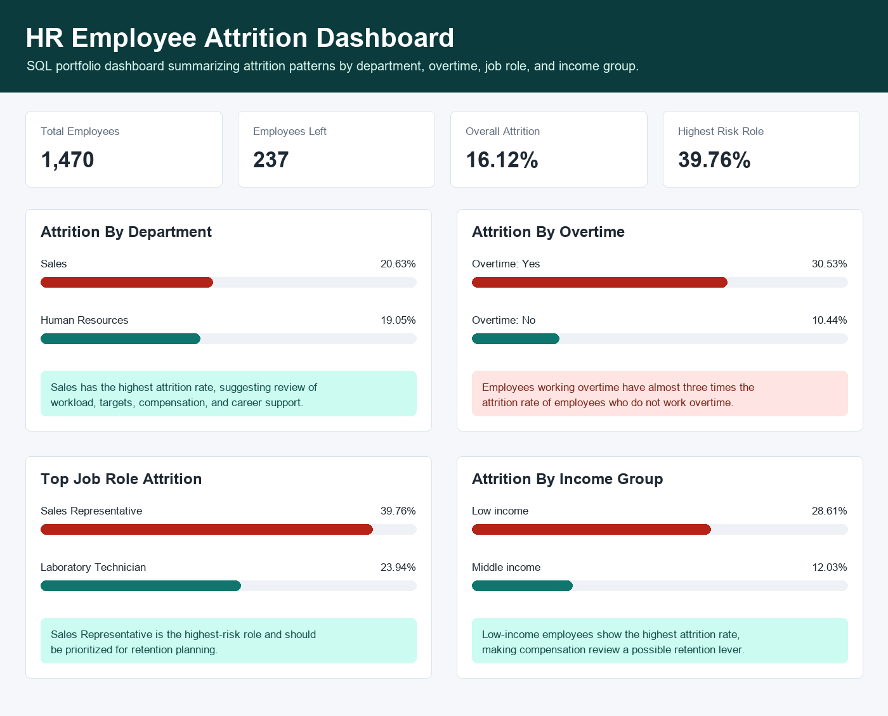

# HR Employee Attrition Analysis Using SQL

## Project Overview

This project uses SQL to analyze employee attrition and identify key workforce patterns that influence employee turnover.

The analysis focuses on the relationship between **department, job role, overtime, and income level** with employee attrition. The goal is to help HR teams identify high-risk areas and support data-driven retention strategies.

---

## Business Objective

Employee attrition increases hiring costs, reduces productivity, and leads to knowledge loss.

This analysis aims to answer:

- What is the overall employee attrition rate?
- Which departments have the highest attrition?
- Does overtime influence employee attrition?
- Which job roles are most at risk of leaving?
- How does income level relate to attrition?

---

## Dataset

- **Source:** IBM HR Analytics Employee Attrition Dataset  
- **Contents:** Employee demographics, job role, department, monthly income, overtime status, and attrition flag  

---

## Tools & Technologies

- SQLite – Database management and SQL querying  
- DB Browser for SQLite – Data import and query execution  
- SQL – Data analysis and transformation  
- HTML/CSS – Dashboard visualization  
- GitHub – Version control and project hosting  

---

## Key Insights

- Overall attrition rate: **16.12%**
- Sales department recorded the highest attrition rate at **20.63%**
- Employees working overtime show significantly higher attrition (**30.53%**) compared to non-overtime employees (**10.44%**)
- Sales Representative role has the highest attrition rate at **39.76%**
- Low-income employees show the highest attrition rate at **28.61%**

---

## Key Takeaways

Attrition is strongly associated with:

- Overtime workload
- Income level
- Sales-related job roles

These patterns suggest that workload balance, compensation structure, and role-specific pressure are key drivers of employee turnover.

---

## Business Recommendations

- Review and rebalance overtime workload across departments  
- Investigate Sales department attrition drivers (targets, incentives, management support)  
- Reassess compensation for low-income employee groups  
- Develop targeted retention strategies for high-risk roles such as Sales Representatives  

---

## Dashboard

### Interactive Dashboard
👉 Open dashboard: **dashboard.html**

### Dashboard Preview

---

## Project Structure
data/                  Raw dataset (CSV files)
queries/               SQL scripts used for analysis
hr_attrition.db        SQLite database file
insights.md            Detailed analysis, insights, and recommendations
dashboard.html         Interactive HTML dashboard
dashboard-preview.png  Dashboard screenshot for preview

---

## SQL Skills Demonstrated

- SELECT queries  
- GROUP BY aggregation  
- CASE WHEN logic  
- COUNT and AVG calculations  
- Attrition rate computation  
- Business-focused SQL interpretation  

---

## Summary

This project demonstrates how SQL can be used to transform raw HR data into meaningful business insights. It highlights key attrition drivers and provides actionable recommendations for HR decision-making and retention strategy planning.
